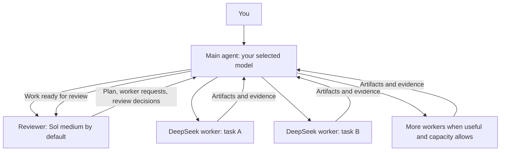

# AiSkills — Parallelism

Parallelism is a Codex skill for running a team of agents with separate planning,
implementation, and acceptance roles. You choose the main model; a reviewer
checks the plan and the resulting work; DeepSeek workers carry out independent
tasks in parallel.

The aim is to finish substantial work faster while keeping review accountable.
It is most useful for work that can be split into clear pieces: multi-file
features, migrations, investigations, and test or documentation work alongside
implementation. A small edit usually does not justify the coordination overhead.

**Start here:** [Installation and dependencies](docs/INSTALLATION.md) ·
[Agent instructions](SKILL.md) · [Change history](CHANGELOG.md)

AiSkills contains **Parallelism at the repository root** and the optional
**[The Council](the-council/SKILL.md)** review skill under `the-council/`.
Existing Parallelism installation paths continue to work. Install the companion
as a separately discoverable `the-council` skill when you want collective review;
see [Council installation](docs/INSTALLATION.md#install-the-optional-council-skill).

## How the team works

| Role | Default model | Responsibility |
| --- | --- | --- |
| Main agent | Whichever model you selected in Codex | Owns the task, talks to you, schedules work, creates all children, and maintains the checkpoint. |
| Planner and acceptance reviewer | Sol, medium reasoning (`gpt-6-sol`) | Approves the plan, identifies useful worker tasks, inspects evidence, and decides what needs correction or research. |
| Workers | DeepSeek V4.1 Flash (`deepseek/deepseek-v4.1-flash`) | Perform bounded research, implementation, verification, or integration with explicit ownership. |



All children are siblings. The reviewer asks the main agent for workers; it does
not create its own nested team. Workers do not spawn agents or approve their own
work. Even if the main model and reviewer use the same model, they remain
separate agents.

A task progresses through these steps:

1. **Agree on the work.** The main agent records your request, amendments,
   constraints, existing changes, and any time, spending, or worker limits.
2. **Plan and divide ownership.** The reviewer proposes tasks, dependencies,
   file ownership, and acceptance criteria. The main agent records them in a
   task ledger.
3. **Run independent tasks.** The main agent dispatches ready jobs. Shared
   files, lockfiles, build outputs, hardware, and deployments are serialized or
   isolated so workers do not overwrite each other.
4. **Collect and verify evidence.** Workers return artifacts and check results.
   Important changes also get verification by someone other than their author.
5. **Review the result.** The reviewer accepts a particular artifact version,
   requests changes, asks for more research, or identifies a blocker. Finishing
   a worker turn does not mean its work has been accepted.
6. **Integrate and close.** Accepted changes are integrated in dependency order,
   combined checks run, and the reviewer considers the final state. The main
   agent reports results and limitations, and clears outstanding wake-ups.

For example, a data-import feature might have separate workers for the parser
and validation module once their interface is agreed. A verifier can check their
frozen outputs; an integration worker then connects them. If validation accepts
an invalid record, the reviewer returns a specific finding to the responsible
worker instead of approving the feature because its tests happened to pass.

## Choose or change the reviewer

Start a task with the skill name and, optionally, a reviewer model and effort:

```text
$parallelism
Implement the import feature and verify the result.
```

```text
$parallelism sol medium
Investigate the failing tests, fix the cause, and review the changes.
```

```text
$parallelism astra low
Build the new API with independent verification.
```

| Invocation | Reviewer selection |
| --- | --- |
| `$parallelism` | Sol, medium reasoning |
| `$parallelism sol medium` | Sol, medium reasoning |
| `$parallelism astra low` | Astra, low reasoning |
| `$parallelism <model> <effort>` | Another model and effort supported by the host's native subagent tools |

The same suffix works after a clickable Parallelism skill mention in Codex.
These arguments select **the reviewer only**. They do not switch your main model
or the DeepSeek workers. `sol` resolves to `gpt-6-sol` and `astra` to
`gpt-6-astra`; those exact routes must be available in your environment.

Repeat the shorthand during work to request a reviewer change. The main agent
hands the replacement reviewer the original request, amendments, evidence,
accepted versions, open findings, and running jobs. Healthy independent workers
continue. The outgoing reviewer loses authority over new decisions, and its late
approvals are ignored. Previous decisions retain their original attribution.
An unavailable model or unsupported effort is reported instead of silently
substituted.

## Optional review by The Council

Parallelism without The Council keeps its existing single-reviewer workflow and
Sol-medium default. The Council is a separate, optional review skill; requesting
it replaces single-person acceptance with a panel of one to three reviewers.

| Invocation | Review behavior |
| --- | --- |
| `$parallelism` | One Sol-medium planner/reviewer, as before. |
| `$parallelism astra low` | One Astra-low planner/reviewer, as before. |
| `$parallelism $the-council` | Three Sol-medium reviewers at a fresh default start. |
| `$parallelism $the-council sol medium, astra low, deepseek high` | Explicit panel; first member leads planning unless you choose another listed member. |
| `$the-council sol medium, sol medium` | Standalone review with two distinct actors. It does not authorize implementation changes. |

The main agent still owns workers, task state and the wake-up timer. One council
member leads planning; there is no fourth lead reviewer. If you bring the council
into existing Parallelism work without specifying its panel, the current reviewer
becomes lead and two Sol-medium members join. Explicit lists select the whole
panel. Model aliases are checked against the host's actual available routes.

Every member receives the same frozen task, requirements and artifact evidence.
Their first reviews are independent. The main agent collates all findings,
preserving minority objections, and returns the same collation to everyone.
Reviewers then reassess specific disagreements using evidence. Completion needs
all participating reviewers to accept the same version, all required checks to
pass, and no supported blocking finding left open. Two approvals cannot erase a
third reviewer's reproduced bug. A timeout is not approval.

Possible outcomes are `COMPLETE`, `CHANGES_NEEDED`, `EVIDENCE_NEEDED`, and
`BLOCKED`. Discussion is bounded; unresolved questions are reported rather than
debated indefinitely. User-requested panel or mode changes carry forward open
findings and historical attribution. They do not erase defects or stale evidence.

The Council has its own read-only decision checker. In council mode its check
and the existing Parallelism ledger check are both required. The legacy ledger
validator alone does not establish consensus. Neither helper authenticates model
execution or establishes the semantic truth of a review. See the
[integration protocol](references/protocol.md#optional-council-integration).

The Council itself needs native reviewer routes, not specifically DeepSeek or
Codex Router. Those dependencies apply when the selected reviewers or workers
use them. Ordinary Parallelism works without installing The Council; an explicit
council request never silently falls back if the skill or a model is missing.

## How much parallelism?

There is **no fixed count of three workers**. The reviewer can request as many
useful independent jobs as the work supports. The main agent fills available
capacity within the host's limits and your budget, reserving room for review.
It stops adding implementation when the review backlog gets too large.

More agents are useful only when there is independent work for them. Ten agents
editing one manifest will not help. Multiple agents also consume additional
tokens, and a slow dependency can still determine completion time. This project
does not claim a measured speedup or cost reduction for arbitrary tasks.

You can add limits in normal language, for example: “Use no more than four
concurrent workers and stop after 30 minutes.” The agent must honor those
limits; the skill cannot enforce provider billing caps. A more capable main
model may help with difficult scheduling and handoffs, but the reviewer remains
responsible for acceptance regardless of the main model's capability.

## What it depends on

| Component | Why it is needed |
| --- | --- |
| Codex with native subagent tools | Provides the main session, child lifecycle, file and tool access, and model selection. |
| Access to the chosen reviewer model | The reviewer needs a working native route and supported reasoning effort. Model availability varies by host/account. |
| DeepSeek access | Supplies worker inference. The documented API setup needs a DeepSeek account, API key, and available quota. |
| Codex Router, or an equivalent working integration | Connects external models such as DeepSeek to Codex. It must support the actual child routes this workflow needs. |
| Python 3.10+ | Runs the ledger helper, scheduler, benchmark fixture, and unit tests. These helpers use the standard library. |
| Git | Installs and updates the skill from this repository. |
| A host timer or task heartbeat | Enables durable wake-ups while children are running. Without it the agent uses bounded native waits and reports that limitation. |
| PyYAML, optional | Needed by the external bundled skill packaging validator, if that validator is installed and used. |

**Codex Router** is a separate, independently maintained community project. It
adapts external provider traffic and tool formats so Codex can execute tools for
those models. Parallelism does not include or install it. See the
[upstream router README](https://github.com/duolahypercho/codex-router).

**DeepSeek** is the worker model provider in the default setup. The router's
namespaced route ID is not necessarily the provider's direct API model name.
You do not need to download model weights, run a local GPU, or install a DeepSeek
Python SDK for this setup. API usage belongs to the provider account configured
in the router; do not assume a ChatGPT subscription covers it. Provider setup is
covered in the [installation guide](docs/INSTALLATION.md#2-connect-deepseek).

**Compatibility matters:** seeing a model in the picker, enabling a subagent
entry, or completing an ordinary model request does not prove that mixed-model
native delegation works. Some router setups pin children to the parent's model;
others can reject a child because of provider/account restrictions. Parallelism
requires the main agent to be able to create the selected reviewer and DeepSeek
workers as distinct native children. It cannot override routing restrictions.
The [route verification steps](docs/INSTALLATION.md#3-verify-native-subagent-routes)
explain how to distinguish configured routes from demonstrated execution.

## Checkpoints, timers, and evidence

The ledger connects each requirement to tasks, acceptance criteria, evidence,
and review decisions. Its validator checks dependencies, ownership collisions,
declared limits, and artifact hashes. A later change to an accepted artifact
requires another review. Model and actor names in a ledger are declarations;
the helper cannot authenticate which model actually executed a turn.

When children are still working, the main agent schedules one wake-up for its
task, records the timer and child IDs, and inspects current status when it wakes.
It reuses a heartbeat rather than creating duplicates and stays quiet for
unchanged checks. It cancels or pauses the wake-up on completion, user stop,
budget exhaustion, or a blocker that prevents further independent work.
Shell sleeps and JavaScript timers do not provide durable continuation after a
turn ends. The skill itself does not run a background daemon.

Parallelism is an instruction package with validation helpers. Its review rules
are not a security boundary, and it does not grant permissions, edit provider
settings, or raise concurrency limits. Deployment, publication, and other
external actions remain subject to the user's authorization and host policy.

## Files and local checks

| Path | Purpose |
| --- | --- |
| [SKILL.md](SKILL.md) | Instructions Codex loads when invoking Parallelism. |
| [docs/INSTALLATION.md](docs/INSTALLATION.md) | Dependencies, setup, route verification, updates, and troubleshooting. |
| [agents/openai.yaml](agents/openai.yaml) | Skill display and invocation metadata; not a model provider configuration. |
| [references/protocol.md](references/protocol.md) | Reviewer and worker briefs, ownership, evidence, and lifecycle rules. |
| [references/ledger.md](references/ledger.md) | Ledger schema and validation/scheduling commands. |
| [references/benchmark.md](references/benchmark.md) | Disposable fixture and grading instructions. |
| [references/design.md](references/design.md) | Design rationale and source references. |
| [scripts/workflow.py](scripts/workflow.py) | Read-only ledger validator and scheduling suggestions. Never spawns agents or executes recorded commands. |
| [scripts/benchmark.py](scripts/benchmark.py) | Creates and grades a disposable fixture. Does not call model APIs. |
| [tests/run_harness.py](tests/run_harness.py) | Combined automated checks and optional packaging validation. |

From the installed skill folder:

```sh
python3 tests/run_harness.py --quiet
```

The Parallelism core suite contains 148 tests; the same command also runs the
optional bundled Council suite when present. `--skip-council` checks only the
existing Parallelism stages. Passing checks verifies the local helper logic;
it does not prove live reviewer routing, DeepSeek inference, timer delivery, or
performance savings. See [installation validation](docs/INSTALLATION.md#5-run-local-checks)
for optional packaging dependencies and a first-task checklist.
